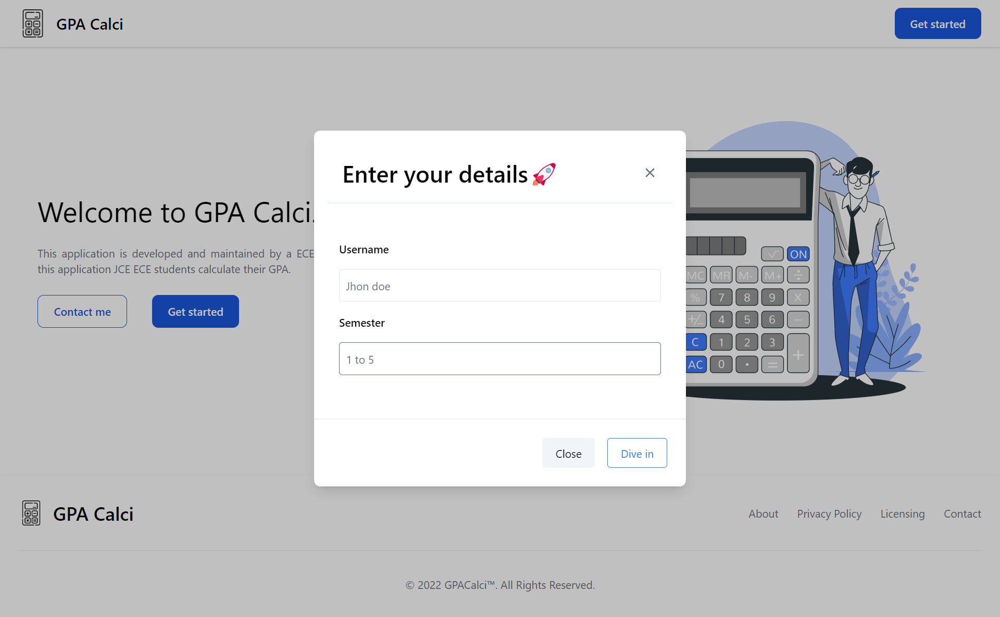

# GPA Calci 🚀💥

This application is developed and maintained by a ECE Student
using this application JCE ECE students calculate their GPA.   

 

 

## Preview

| 1. Go to our app GPA Calci.0                                           |           |
| ---------------------------------------------------------------------- | -------------------------------------------------------- |
| 2. Click on `Get Started` and voila! your Modal popup appear.          |           |
| 3. Enter Your `Name and which Sem` you want your GPA to be Calculated. |      |
| 4. Click on `Dive in` and voila! your Semester 1 page appears.         |  |
| 5. Choose your `Grade` .                                               |       |
| 6. Hit `Calculate Gpa` and voila! your GPA appears.                    |     |

## Thanks for Reading!
